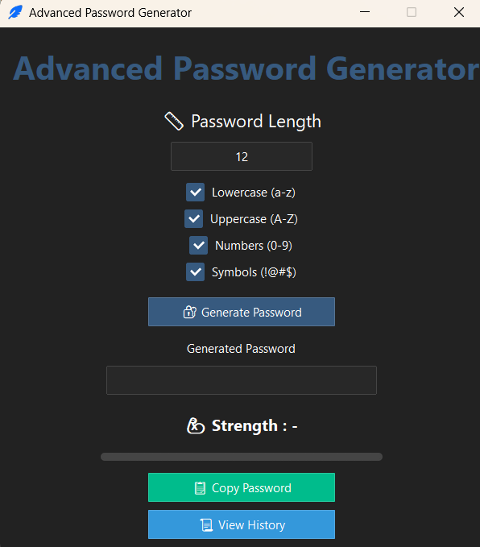
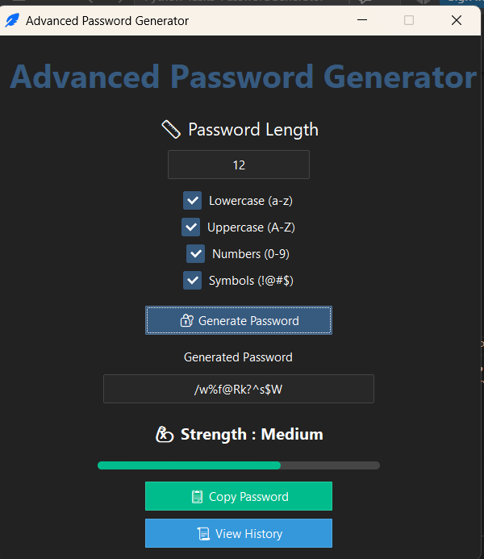
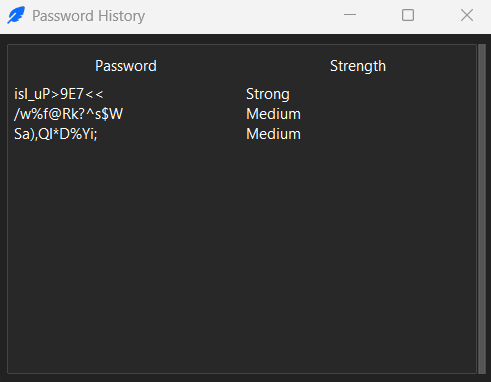

# 🔐 Advanced Random Password Generator

A secure and modern **Random Password Generator** built using Python during the **Oasis Infobyte Python Programming Internship**.

The application provides a graphical user interface to generate strong passwords with customizable options, password strength analysis, clipboard support, and password history management.

---

## 🚀 Features

✅ Generate secure random passwords  
✅ User-defined password length  
✅ Select character types:
- Lowercase letters (a-z)
- Uppercase letters (A-Z)
- Numbers (0-9)
- Symbols (!@#$)

✅ Password strength detection:
- Weak
- Medium
- Strong

✅ Copy generated password to clipboard  
✅ Store password history using SQLite database  
✅ View password history with scrollbar  
✅ Clear password history  
✅ Modern dark-themed GUI interface  

---

## 🛠️ Technologies Used

- **Python**
- **Tkinter**
- **ttkbootstrap**
- **SQLite**
- **Pyperclip**
- **Secrets Module**

---

## 📂 Project Structure
Python-Task3-PasswordGenerator
│
├── password_generator.py
├── passwords.db
├── README.md
├── requirements.txt
│
└── screenshots
├── home.png
├── password.png
└── history.png


---

## ⚙️ Installation

### 1. Clone the Repository

```bash
git clone YOUR_REPOSITORY_LINK

2. Navigate to Project Folder
cd Python-Task3-PasswordGenerator
3. Install Required Libraries
pip install -r requirements.txt
▶️ How to Run

Run the application using:

python password_generator.py

## 📸 Screenshots

### 🏠 Home Screen




### 🔐 Generated Password




### 📜 Password History



🔒 Security

This project uses Python's built-in secrets module for generating random passwords, which provides stronger randomness compared to the normal random module.

🎯 Learning Outcomes

Through this project, I learned:

GUI development using Tkinter
Database integration with SQLite
Secure password generation techniques
Clipboard handling
Creating professional desktop applications

👩‍💻 Author

Rutuja Sabale

Python Programming Intern
Oasis Infobyte
